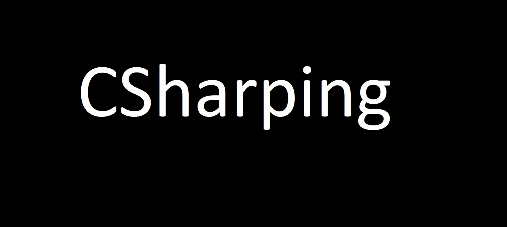

CSharping (Title)
===

# C# Programming Basics (H1)
This is a C# Solution, Which covers all essential concepts for Beginner

## Types (H2)
- Class (Unordered List)
- Interface
- Structure
- Enum
- Array
- Collection
### This has lot more features (H3)
```
This solution contains many .csproj files (Card)
```


# C# with Databases (H1)
This covers connections and data transactons with all major Database Applications
1. SQL Server (Ordered List)
2. MySQL
3. MongoDB
4. Firebase(Firestore, RealTime Database)
## SQL Server (H2)

## MySQL (H2)
 
## MongoDB (H2)
This includes 
## Firebase (H2)
This included FireStore and RealTime Databases





# C# Hidden Hints, Suggestions and Tips (H2)
`namespace DataStructures
{
    class Program
    {
        static void Main(string[] args)
        {
            Console.WriteLine("Hello World!");
        }
    }
}
(Code)
`

# License (Horizontal Rule)
---

**Developed by Kanna Reddy (Bold)** ~~© 2019 (Strikethrough)~~ *kannareddy.com (Italic)*
[Source URI (Link)](https://www.kannareddy.com)

	> Share and Contribute (Blockquote)

### Task List	
- [x] Write the press release
- [ ] Update the website
- [ ] Contact the media

### Definition List
term: definition


### Footnote
Here's a sentence with a footnote. [^1]
[^1]: This is the footnote.


### Table
| Syntax | Description |
| ----------- | ----------- |
| Header | Title |
| Paragraph | Text |